## ✅ 不需要专用客户端
> [!tip]
> + 你可以使用符合当前服务器版本的[1.20.2]任意客户端加入服务器；
> + 只需要输入IP `mc.morp.cc`即可连入。

## ⬇️ 下载并解压客户端

**1. 打开[QQ群聊](https://qm.qq.com/q/AqCKPV9ERy)(858675200)，点击“文件”**

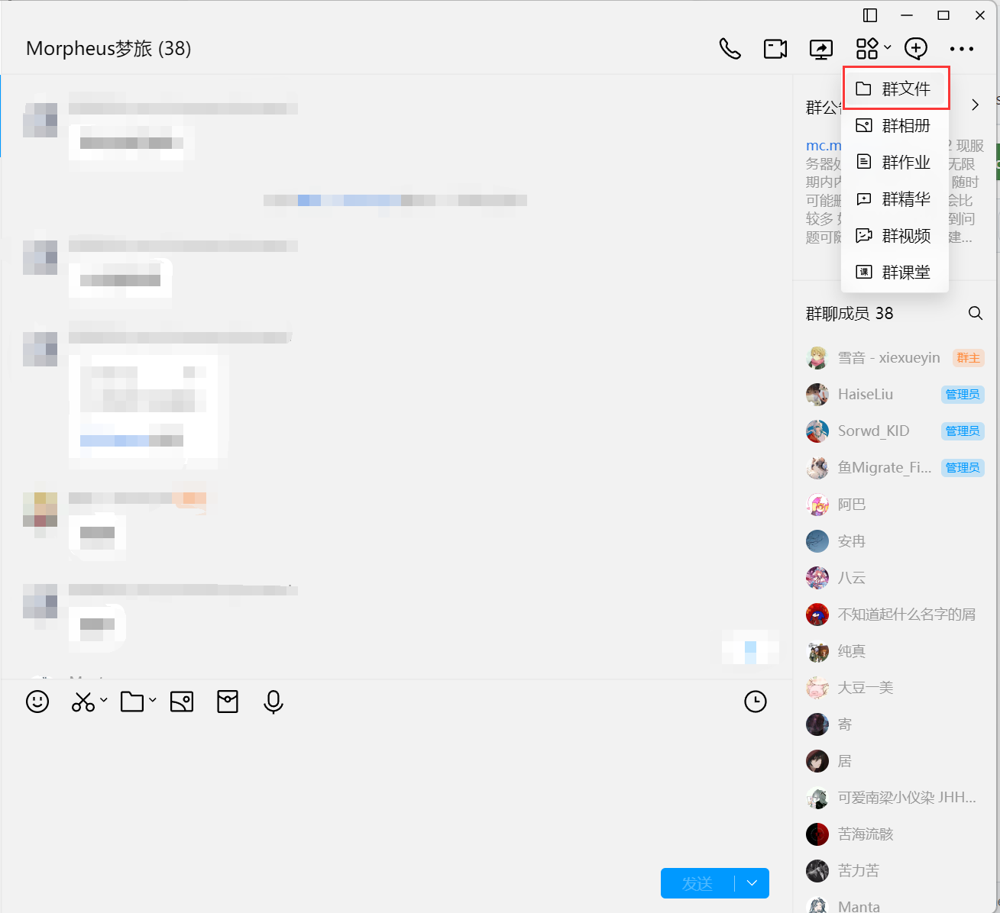

**2. 打开`★【服务器相关】`文件夹**

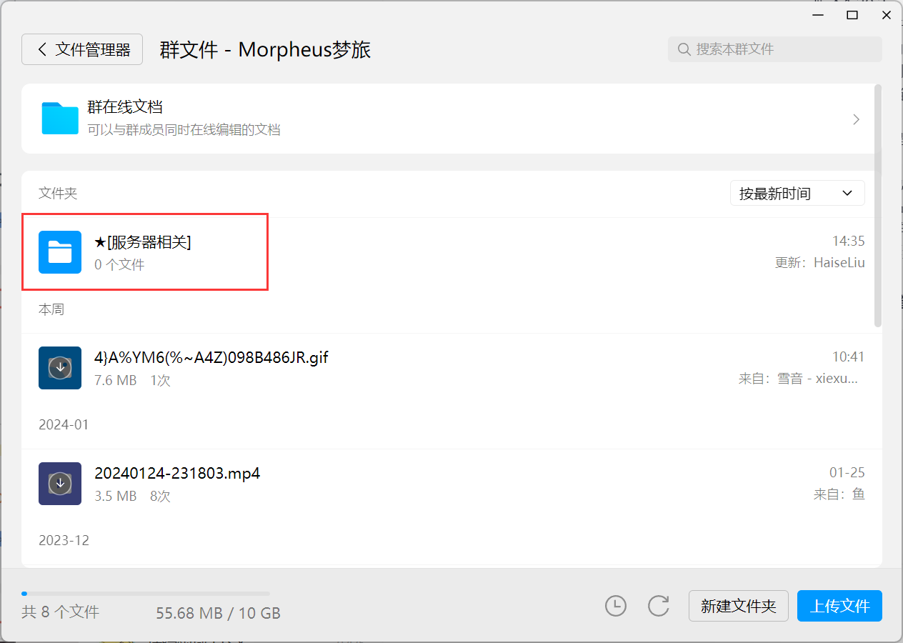

**3. 下载推荐客户端`Morpheus推荐客户端`**

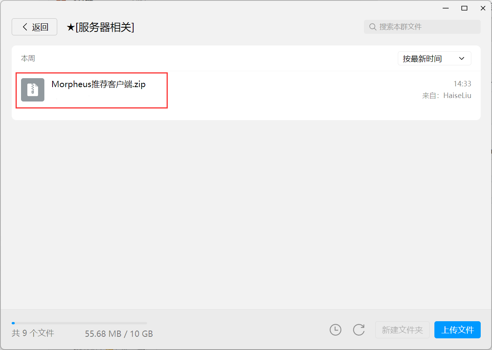

**4. 解压到"Morpheus推荐客户端"**

> [!warning]
请勿直接在桌面上使用"解压到当前文件夹"

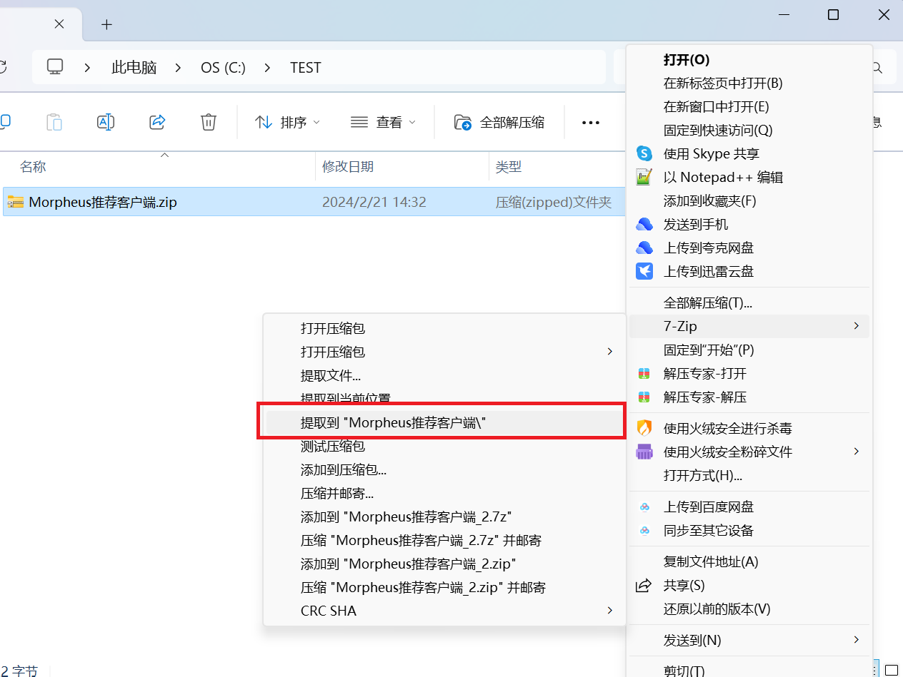

**5.进入文件夹内，双击HMCL启动器后会自动下载补全文件**

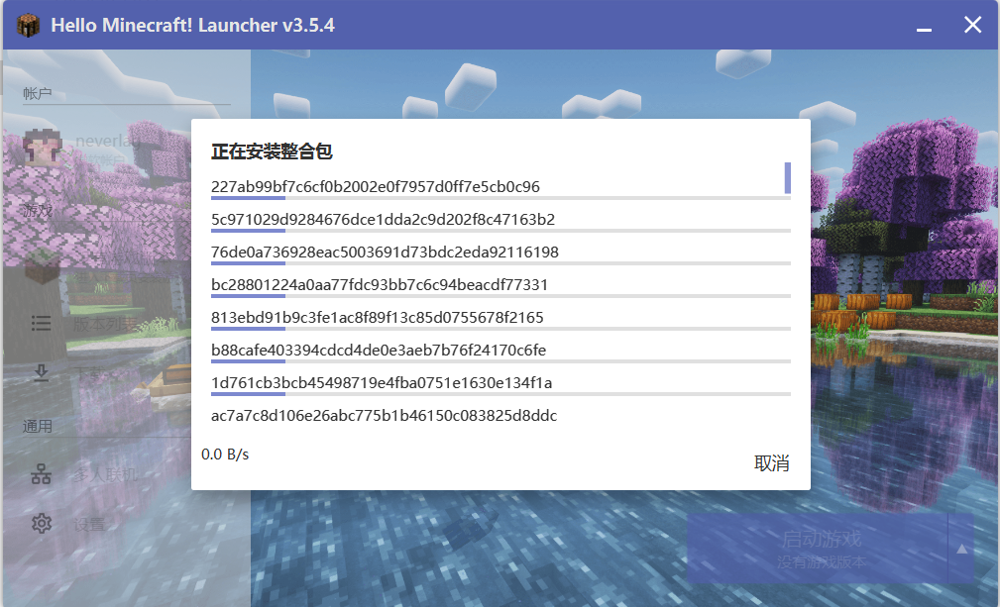

## 🕹️ 登录正版账号

**1.点击"没有游戏账户"**

**2.选择微软账户开始登录**

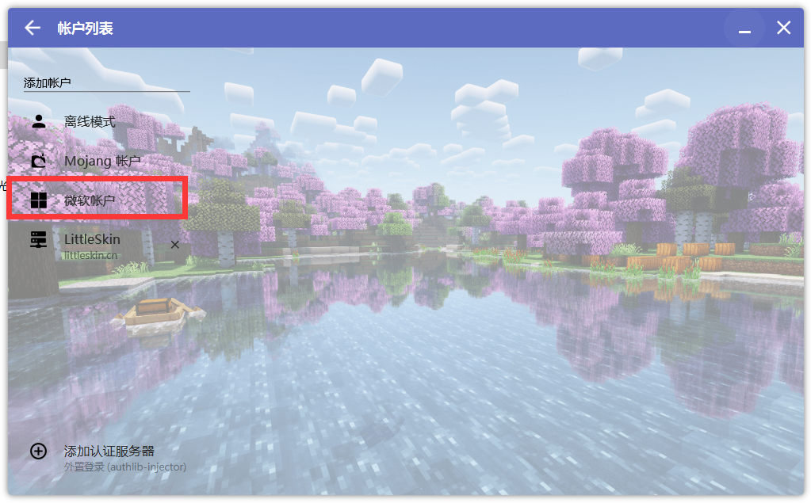

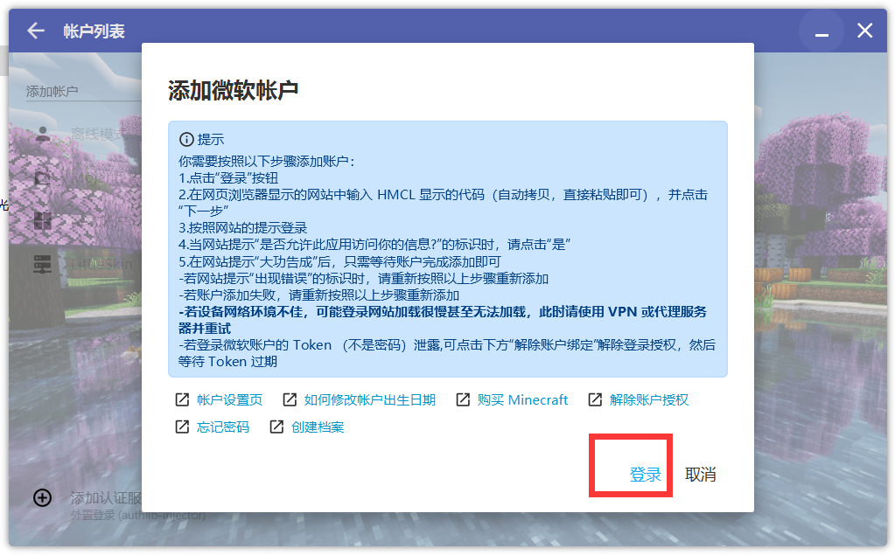

**3.在跳转的网页内，用Ctrl+V粘贴验证码**

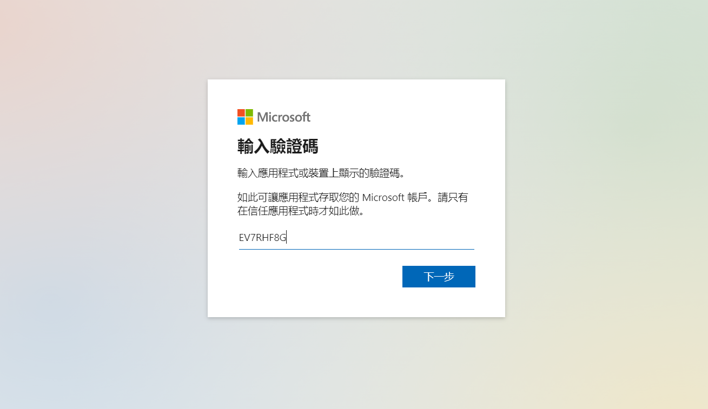

**4.登录你的微软账号**

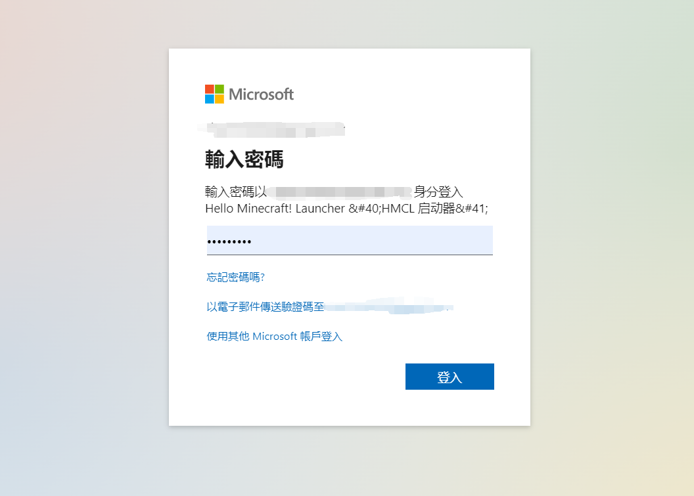

**5.返回启动器并启动游戏**

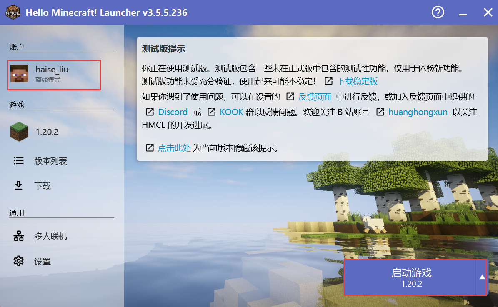

## 🕹️ 登录离线账号

**1.点击"没有游戏账户"**

**2.选择离线模式**

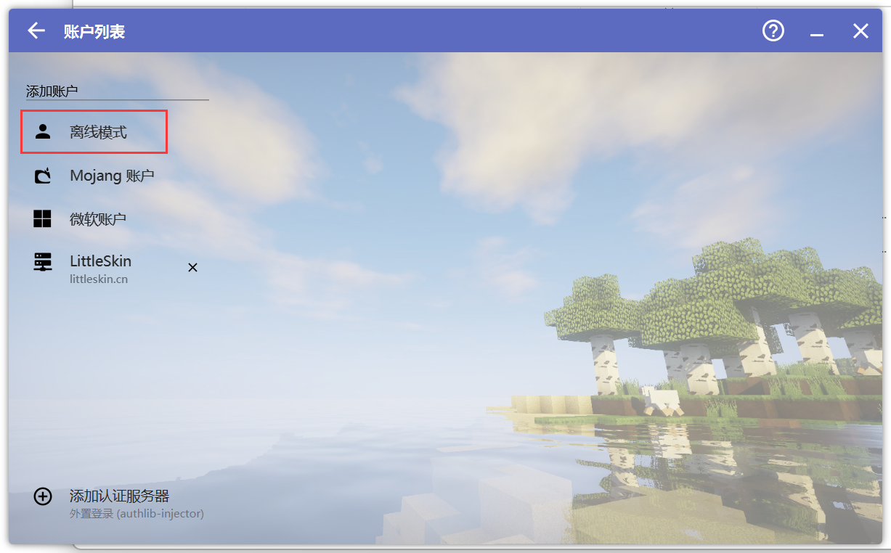

**3.输入你喜欢的用户名并点击登录**

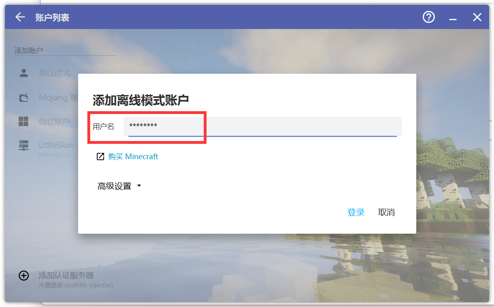

**4.返回启动器并启动游戏**

